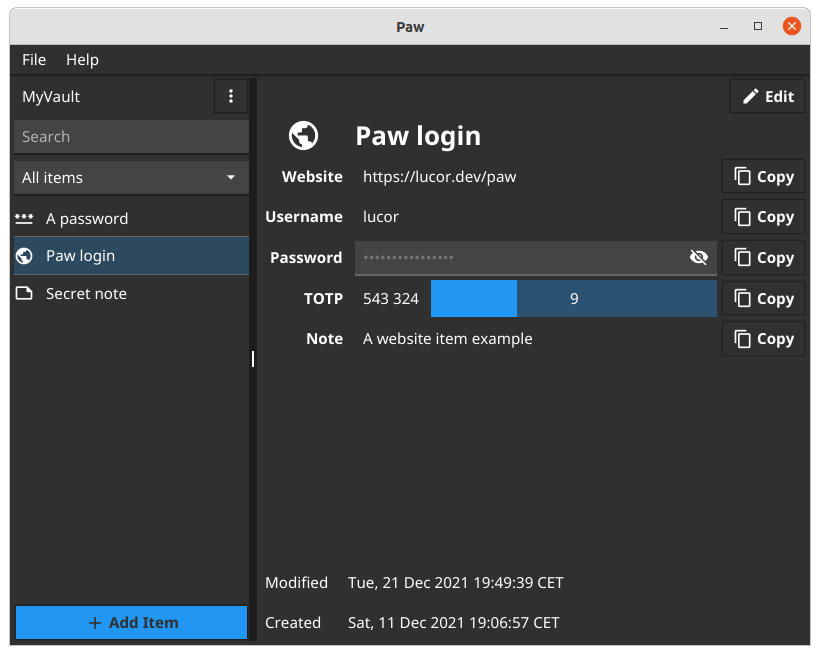

<div align="center">
    
</div>

# Paw

Paw is a cross platform application to manage your passwords and identities securely.

It is written in Go and uses [Fyne](https://github.com/fyne-io/fyne) as UI toolkit and [age](https://github.com/FiloSottile/age) as encryption library.

## Screenshot

<div align="center">
    
</div>

## Main goals

* Cross platform application (linux, macOS, Windows, BSD ...) with a single codebase
* Open source: code can be audited
* Only one secret key to remember used to store securely your passwords

### Later goals

* Audit passwords against data breach
* Automatically detect and use password rules for known web sites that require ones
* Automatic backup / syncronization
* CLI application
* Mobile / Web applications
* Password import
* Stateless password derivation support
* Unicode password support

## Installation

```
go install lucor.dev/paw/cmd/paw@latest
```

## How it works - cryptography details

### Vault initialization

One or more vaults can be initialized to store passwords and identities.

When the vault is initialized user will be prompt for a password and a vault name.
A symmetric secret key is derived with [Scrypt](https://pkg.go.dev/golang.org/x/crypto/scrypt) using the provided password and the vault name as salt.
The vault data is encrypted with [age](https://github.com/FiloSottile/age) using an X25519 Identity seeded with the symmetric secret key.

Vault internally is organized hierarchically like:
```
- vault
    ├── website
    |    └── www.example.com
    |    └── my.site.com
    ├── password
    |    └── mypassword
    └── note
         └── mysecretnote
```

where website, password and note are the Paw items, see the dedicated section for details.

### Add an item to the vault

Items are special templates aim to help the identity management.

Currently the following items are available:

- note
- password
- website

### Generated password

Generated password are derived reading byte-by-byte the block of randomness from a [HKDF](https://pkg.go.dev/golang.org/x/crypto/hkdf) cryptographic key derivation function. Printable characters that match the desired password rule (uppercase, lowercase, symbols and digits) are then included in the generated password.

### Custom password

In use cases where a generated password is not applicable a custom password can be specified. 

## Threat model

The threat model of Paw assumes there are no attackers on your local machine.

## Contribute

- Fork and clone the repository
- Make and test your changes
- Open a pull request against the `develop` branch

## Contributors

See [contributors](https://github.com/lucor/paw/graphs/contributors) page
