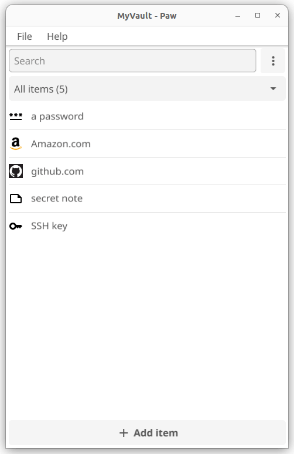

<div align="center">
    
</div>

# Simple, modern and privacy-focused Open Source password manager

Paw is a password manager designed to offer a secure and user-friendly solution for managing your digital data across multiple platforms, featuring modern encryption, making it an ideal tool for both personal and professional use.

It is written in Go and uses [Fyne](https://github.com/fyne-io/fyne) as UI toolkit and [age](https://github.com/FiloSottile/age) as encryption library.

## Warning

**This software is work in progress, and didn't went through a full security audit.**

**Do not expect it to be bug free and do not rely on it for any type of security.**

## Screenshot

<div>
    
    
</div>

## Main features

* Cross platform application (linux, macOS, Windows, BSD ...) with a single codebase
* Desktop, Mobile and CLI application with a single binary
* Minimal direct dependencies
* Agent to handle SSH keys and CLI sessions
* Open source: code can be audited
* Audit passwords against data breaches
* TOTP support
* Password import/export

### Later goals

* Automatically detect and use password rules for known web sites that require ones
* Automatic backup / syncronization
* Web application
* Stateless password derivation support
* Unicode password support

## Installation

### Latest version

You can download the latest version as a binary from https://paw.pm/download

### Development version

To try the development version or help with testing:

```
go install lucor.dev/paw@latest
```

## How it works - cryptography details

### Vault initialization

One or more vaults can be initialized to store passwords and identities.

When the vault is initialized user will be prompt for a vault name and password.
An [age](https://github.com/FiloSottile/age) key is generated and it is encrypted using an age Scrypt recipient with the provided password and saved on disk (key.age)
The X25519 identity and its recipient from the key file are used to decrypt and encrypt the vault data.
Each item is stored separately on disk so that the content can be decrypted manually using the age tool, if needed.
All the items' metadata are encrypted and stored into the vault.age file so that no information are in clear text.

### Random password

Random password are derived reading byte-by-byte the block of randomness from a [HKDF](https://pkg.go.dev/golang.org/x/crypto/hkdf) cryptographic key derivation function that uses the age key as secret. Printable characters that match the desired password rule (uppercase, lowercase, symbols and digits) are then included in the generated password.

### Custom password

Where a generated password is not applicable a custom password can be specified. 

### Vault structure

Vault internally is organized hierarchically like:
```
- vault
    ├── login
    |    └── www.example.com
    |    └── my.site.com
    ├── password
    |    └── mypassword
    └── note
         └── mysecretnote
```

where login, password and note are the Paw items, see the dedicated section for details.

### Items

Items are special templates aim to help the identity management.

Currently the following items are available:

- login
- note
- password
- ssh_key

## Threat model

The threat model of Paw assumes there are no attackers on your local machine.

## License

This project is licensed under the GNU Affero General Public License v3.0 or later (AGPL-3.0-or-later), unless otherwise noted. See the [LICENSE](LICENSE) file for details.

Some components may be licensed under different terms - see individual file headers for specific licensing information and the [THIRD_PARTY_LICENSES](THIRD_PARTY_LICENSES) file for third-party dependencies.

## Contribute

See https://lucor.dev/projects/#maintenance-policy

## Credits

 - [age](https://github.com/FiloSottile/age) for the encryption library
 - [Fyne](https://github.com/fyne-io/fyne) for the UI toolkit
 - [Tabler icons](https://tabler.io/icons) for the icons

Also thanks to these Open Source password managers that inspired Paw:

- [gopass](https://github.com/gopasspw/gopass)
- [lesspass](https://github.com/lesspass/lesspass)
- [pass](https://www.passwordstore.org/)
- [passage](https://github.com/FiloSottile/passage)
- [passgo](https://github.com/ejcx/passgo)
